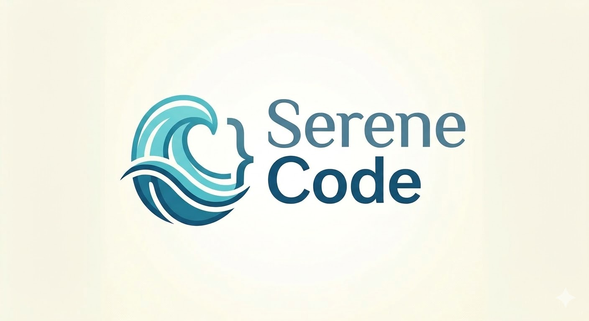

<p align="center">
  
</p>

<h3 align="center">A Framework for AI-Driven Development of Verifiable Systems</h3>

SereneCode is a spec-to-verified-implementation framework for AI-generated Python. It ensures that every requirement in your spec is implemented, tested, and formally verified — closing the gap between what you asked for and what the AI built. The workflow starts from a spec with traceable requirements (REQ-xxx), enforces that the AI writes verifiable code with contracts and tests, then verifies at multiple levels — from structural checks and test coverage through property-based testing to symbolic execution with an SMT solver. You choose the verification depth during interactive setup: lightweight for internal tools, balanced for production systems, strict for safety-critical code.

SereneCode also ships a built-in **MCP server** so verification runs *inside* your AI assistant's edit loop, not just at the end. Once registered with Claude Code, Cursor, Cline, or Continue, the agent calls verification tools after every function it writes — getting structured findings, contract suggestions, and counterexamples back as JSON, fixing them mid-turn, and only reporting the work complete when the result is clean. AI agents write code fast but can miss requirements and skip edge cases; SereneCode closes that gap with spec traceability, test-existence enforcement, formal verification, and an MCP-driven inner loop the agent can drive on itself.

> **This framework was bootstrapped with AI under its own rules.** SereneCode's SERENECODE.md was written before the first line of code, and the codebase has been developed under those conventions from the start — including the MCP server, which the same AI agents now use to verify their own work mid-edit. The current tree passes its own `serenecode check src --level 6 --allow-code-execution` end-to-end via the bare CLI (718 functions checked, 557 passed, 161 exempt; ~6 minutes wall time), an internal strict-config Level 6 self-check in the test suite (`pytest tests/integration/test_example_projects.py::test_serenecode_repo_passes_strict_level_6`, which exercises L4-L6 against `strict_config` over the full source tree), `mypy src examples/dosage-serenecode/src`, the shipped dosage example's own `serenecode check src --level 6 --allow-code-execution`, and the full `pytest` suite (1,393 passing tests, 16 skipped). The verification output is transparent about scope: exempt modules (adapters, CLI, ports, MCP server, `__init__.py`) and functions excluded from deep verification (non-primitive parameter types) are reported as "exempt" rather than silently omitted.

---

## Why This Exists

AI writes code fast. But *fast* and *correct* aren't the same thing. When you're building a medical dosage calculator, a financial ledger, or an avionics controller, "it passed my tests" isn't enough. Tests check the inputs you thought of. Formal verification uses an SMT solver to search for *any* input that breaks your contracts.

The problem is that formal verification has always been expensive — too slow, too manual, too specialized. SereneCode makes it tractable by controlling the process from the start: a convention file tells the AI to write verification-ready code, a structural linter checks it followed the rules, and CrossHair + Z3 search for contract violations via symbolic execution.

### Common AI failure modes SereneCode is built to catch

After enough hours pair-programming with coding agents, the same handful of mistakes show up over and over. They're not random bugs — they're systematic patterns that follow from how a language model writes code: optimize for the happy path, infer intent from limited context, finish the visible task, leave implicit assumptions implicit. SereneCode treats each one as a verification target rather than a code-review target.

- **Skipping requirements without realizing it.** Given a spec with twelve requirements, the agent writes code that handles eight of them confidently and quietly omits the four it didn't see a clean place for. There's no error, no TODO — just missing behavior. SereneCode's spec traceability (REQ-xxx tags, `Implements:` / `Verifies:` references, the `serenecode_orphans` and `serenecode_req_status` tools) makes it impossible for a requirement to be silently dropped: every REQ in SPEC.md must be both implemented and tested or it shows up as an orphan.

- **Happy-path tests only.** Asked to "add tests," the agent writes a handful of cases that walk the obvious path through the function. Edge cases (empty input, off-by-one boundaries, the exact threshold value, the negative number, the unicode string) are routinely missed because they require imagining what could go wrong. L3 coverage catches uncovered branches; L4 Hypothesis property testing generates inputs the agent never thought of and runs them against the contracts.

- **Stub residue and "I'll come back to this."** A function the agent didn't quite know how to write often ships as `pass`, `...`, or `raise NotImplementedError("TODO")` — and then never gets revisited because the test suite doesn't fail on it. L1's stub-residue check flags these immediately.

- **Weak or tautological postconditions.** Asked to add a contract, the agent reaches for whatever satisfies the structural checker without actually constraining behavior: `lambda result: isinstance(result, int)` on a function that already returns `int`, or `lambda result: True`. These pass every check but verify nothing. L1 flags both patterns.

- **Silent exception handling.** `try: risky() / except Exception: pass` is a load-bearing anti-pattern in agent-generated code. The agent encounters an error during testing, decides the cleanest fix is to swallow it, and ships code where real failures vanish into the void. L1 flags any handler whose body is `pass`, `...`, `continue`, `break`, or a bare `return` and demands a meaningful response or an explicit `# silent-except: <reason>` opt-out.

- **Mutable default arguments.** `def f(x=[])` is a Python footgun every senior developer learned to avoid the hard way. Agents reproduce it cheerfully because they pattern-match on shape, not language semantics. L1 catches it by default.

- **Bare `assert` as a runtime check.** Agents reach for `assert x > 0` to "validate input" — but assertions disappear under `python -O`. The check vanishes silently in any production environment that strips them. L1 flags asserts in non-test source.

- **`print()` debug residue.** Trace prints from the agent's own debugging session ship to production because nobody pruned them. L1 catches `print()` in core modules.

- **Unsafe deserialization and shell calls.** `eval`, `exec`, `pickle.loads` on untrusted input, and `subprocess.run(..., shell=True)` are calls a security-aware human writes only with a comment explaining why. Agents reach for them when the simple solution looks fastest. L1 flags every one, requiring an `# allow-dangerous: <reason>` opt-out for the rare legitimate case.

- **Tests that pass but verify nothing.** A `def test_foo(): foo()` with no `assert` runs successfully and counts as "covered" — but it only checks that the function doesn't raise. L1's no-assertions-in-tests check fires on any `test_*` function with no `assert`, `pytest.raises`, `pytest.fail`, or `self.assertX` call.

- **Architectural drift.** Asked to "add a feature," the agent puts I/O in core, business logic in adapters, and circular imports between them. The system still works in tests because everything is loaded together — but the layering rule that made the code testable in the first place is gone. L6 compositional checks enforce dependency direction, interface compliance, and contract presence at module boundaries.

None of these failures are unique to AI; humans make them too. What's unique is the *rate* at which an agent produces them and the *confidence* with which the agent reports the work as done. The structural checker, the contracts, the property tester, and the symbolic search exist to make each pattern impossible to ship without an explicit, reviewed override.

SereneCode is designed for **building new verifiable systems from scratch with AI**, not for retrofitting verification onto large existing codebases. The conventions go in before the first line of code, and every module is written with verification in mind from day one. That's what makes it work. SereneCode is a best-effort tool, not a guarantee — see the [Disclaimer](#disclaimer) for important limitations on what it can and cannot assure.

### Choosing the Right Level

The cost of verification should be proportional to the cost of a bug. Each level generates a different SERENECODE.md with different requirements for the AI, so the choice shapes how code is *written*, not just how it's checked. You make this choice during `serenecode init` — it cannot be changed after implementation starts.

| | **Minimal** (Level 2) | **Default** (Level 4) | **Strict** (Level 6) |
|---|---|---|---|
| **Verifies through** | L2 (structure + types) | L4 (+ test coverage + properties) | L6 (+ symbolic + compositional) |
| **What the AI must write** | Contracts on public functions, type annotations | + description strings, class invariants, hexagonal architecture | + contracts on *all* functions, loop invariants, domain exceptions, no exemptions |
| **What catches bugs** | Runtime contract checks, mypy | + L3 surfaces untested code paths and generates test suggestions; L4 tests contracts against hundreds of random inputs | + SMT solver searches for *any* counterexample within analysis bounds |
| **Good for** | Internal tools, scripts, prototypes | Production APIs, business logic, data pipelines | Medical, financial, infrastructure, regulated systems |
| **The tradeoff** | Low ceremony, but contracts are only checked at the boundaries you wrote them | Moderate overhead; architecture rules keep core logic pure and testable | Significant overhead — every loop gets an invariant comment, every helper gets a contract. Justified when the cost of an undiscovered bug is measured in patient harm, financial loss, or regulatory failure |

Pick the level that matches the stakes. Safety-critical code should start at Strict.

---

## See It In Action: The Medical Dosage Calculator

> **This is a hypothetical example for demonstration purposes only.** The medical dosage calculator is not a real, clinically validated, or regulator-approved tool. It is not derived from any actual drug-dosing protocol, has not been reviewed by medical professionals, and must not be used for any clinical decision-making. Its purpose is solely to illustrate how SereneCode shapes the way an AI agent writes verifiable code in a context where contracts and bounded symbolic search would matter. Building real medical software requires domain experts, regulated processes, and assurance methodologies that go far beyond what this framework provides.

We built the same medical dosage calculator twice from the same spec — once with plain AI, once with SereneCode — to show the difference.

Both versions implement four functions: dose calculation with weight-based dosing and max caps, renal function adjustment with tiered CrCl thresholds, daily safety checks with explicit total-versus-threshold calculations, and contraindication detection across current medications.

Both versions implement the same requirements, and the plain version passes its 59-test suite. Here's what SereneCode adds on top:

| What can you claim? | Plain AI | SereneCode |
|---|---|---|
| **Dose never exceeds maximum** | Covered by unit tests | Encoded as a postcondition; bounded symbolic search found no counterexample within analysis bounds |
| **Renal adjustment never increases a dose** | Covered by unit tests | `result <= dose_mg` is an executable contract, not just a test expectation |
| **Safety result is internally consistent** | No validation — you can construct `SafetyResult(total=9999, max=100, is_safe=True)` | Postcondition on `check_daily_safety` enforces `is_safe == (total <= max)` — inconsistent results cannot be produced through the contracted API |
| **Objects are truly immutable** | `frozen=True` with mutable `set` on Drug | `frozen=True` with class invariants enforcing valid state — mutations raise `FrozenInstanceError` and invariants guarantee internal consistency |
| **Boundary behavior (CrCl exactly 30.0)** | Covered by explicit tests | Boundary behavior is specified in contracts; bounded symbolic search found no counterexample |
| **What if someone changes the code later?** | You rely on the tests you remembered to keep | Contracts stay attached to the code and keep checking every contracted call |
| **Can a solver verify it?** | No executable specification for a solver to target | 42 executable contracts and a clean `serenecode check ... --level 6 --allow-code-execution` run |
| **Confidence in a safety-critical setting** | Better than ad hoc code, but still test-shaped confidence | Higher: behavior is formally specified, runtime-checked, and solver-checked within analysis bounds — but bounded search is not proof |

The plain version relies on 59 tests that check specific scenarios. The SereneCode version adds 42 executable contracts across its domain models and core dosage logic. Those contracts define *what correct means* in code, get checked at runtime, and give CrossHair/Z3 something precise to search against when looking for counterexamples within analysis bounds.

> Both examples live in [`examples/dosage-regular/`](examples/dosage-regular/) and [`examples/dosage-serenecode/`](examples/dosage-serenecode/). Read them side by side.

The Serenecode dosage example currently passes `serenecode check src/ --level 6 --allow-code-execution` from within the example directory. Its local `pytest` suite is also green with 67 passing tests.

---

## How It Works

### 1. Interactive Setup — `serenecode init`

Run `serenecode init` and answer two questions:

**Spec question:** Do you already have a spec, or will you write one with your coding assistant? Both options set up spec traceability with REQ-xxx requirement identifiers — the difference is the workflow your assistant follows.

**Verification level:** Minimal (L2), Default (L4), or Strict (L6). This determines what conventions your SERENECODE.md will require and cannot be changed after implementation starts.

```bash
serenecode init
```

This creates SERENECODE.md (project conventions including spec traceability) and CLAUDE.md (instructions for your AI coding assistant) tailored to your answers. The conventions become the contract between you, your coding assistant, and the verification tool. SERENECODE.md includes instructions for converting raw specs into SereneCode format (REQ-xxx identifiers), validating them with `serenecode spec SPEC.md`, creating an implementation plan, and building from it — the coding agent handles this workflow automatically.

### 2. The Checker — Structural Enforcement

A lightweight AST-based checker that validates code follows SERENECODE.md conventions in seconds. Missing a postcondition? No class invariant? No test file for a module? Caught before you waste time on heavy verification.

L1 also catches AI-failure-mode patterns that compile and look correct but represent real bugs: stub residue (`pass`/`...`/`raise NotImplementedError` left as a function body), mutable default arguments, bare `assert` in non-test source, `print()` in core, dangerous calls (`eval`, `exec`, `pickle.loads`, `os.system`, `subprocess` with `shell=True`), `TODO`/`FIXME`/`XXX`/`HACK` markers in tracked files, tests with no assertions, silent exception handlers, and tautological postconditions. Each rule has a per-rule opt-out comment for legitimate exceptions; see SERENECODE.md "Code Quality Standards" for the full list.

```bash
serenecode check src/ --structural          # structural conventions
serenecode check src/ --spec SPEC.md        # + spec traceability
```

The `--spec` flag verifies that every REQ in the spec has an `Implements: REQ-xxx` tag in the code and a `Verifies: REQ-xxx` tag in the tests. No requirement goes unimplemented or untested.

### 3. The Verifier — Deep Verification

A six-level verification pipeline that escalates from fast checks to full symbolic verification:

| Level | What | Speed | Backend |
|-------|------|-------|---------|
| **L1** | Structural conventions | Seconds | AST analysis |
| **L2** | Type correctness | Seconds | mypy --strict |
| **L3** | Test coverage analysis | Seconds–minutes | coverage.py |
| **L4** | Property-based testing | Seconds–minutes | Hypothesis |
| **L5** | Symbolic search (bounded) | Minutes | CrossHair / Z3 |
| **L6** | Cross-module verification | Seconds | Compositional analysis |

```bash
serenecode check src/ --level 6 --allow-code-execution  # verify it
```

**L3 Test Coverage** is where SereneCode checks that the AI's tests actually exercise the code it wrote. AI agents can be suboptimal at writing tests — they tend to cover the happy path, skip edge cases, and miss error branches. L3 runs your existing tests under coverage.py tracing, measures per-function line and branch coverage, and reports exactly which lines and branches are untested. For each coverage gap, it generates concrete test suggestions including mock necessity assessments: each dependency is classified as REQUIRED (external I/O — must mock) or OPTIONAL (internal code — consider using the real implementation). This gives the AI agent actionable feedback to improve its own tests rather than leaving coverage gaps undetected. When no tests exist for a module, L3 reports this as a failure — missing tests must be written. At L1, the structural checker also verifies that every non-exempt source module has a corresponding `test_<module>.py` file.

The full pipeline is thorough but not instant. Larger systems will take longer, and the deepest runs may surface skipped items when Hypothesis cannot synthesize valid values for complex domain types or when CrossHair hits its time budget. By default, L5 focuses on contracted top-level functions defined in each module and skips modules or signatures that are currently poor fits for direct symbolic execution, such as adapter/composition-root code, helper predicate modules, and object-heavy APIs. Not everything needs L5/L6. Critical paths get full symbolic and compositional verification. Utility functions get property testing. A Level 4 run only counts as achieved when at least one contracted property target was actually exercised.

Levels 3-6 import and execute project modules so coverage.py, Hypothesis, and CrossHair can exercise real code. Deep runs therefore require explicit `--allow-code-execution` and should only be used on trusted code.

### 4. The MCP Server — Verification Inside the Agent's Edit Loop

SereneCode ships a built-in MCP (Model Context Protocol) server that exposes the entire verification pipeline as tools any MCP-speaking AI coding assistant can call *while it writes code*, not just at the end. Instead of waiting for `serenecode check` to run at the bottom of a feature, the agent calls `serenecode_check_function` after every function it writes, sees structured findings inline, fixes them, and only reports the work complete when the result is clean. This collapses the feedback loop from minutes-after-writing to seconds-while-writing and turns serenecode from a batch tool you run *at* the agent into a peer tool the agent uses *on itself*.

**Setup (one-time):**

```bash
uv add 'serenecode[mcp]'
claude mcp add serenecode -- uv run serenecode mcp                          # read-only (L1, L2)
claude mcp add serenecode -- uv run serenecode mcp --allow-code-execution   # all six levels
```

The same `serenecode mcp` stdio server works in Claude Code, Cursor, Cline, Continue, and any other MCP client.

**Tools the agent can call:**

| Tool | What it does |
|---|---|
| `serenecode_check` | Run the full pipeline on a project root |
| `serenecode_check_file` | Pipeline scoped to one source file |
| `serenecode_check_function` | Pipeline scoped to one function — the inner-loop tool |
| `serenecode_verify_fixed` | Re-run on one function and report whether a specific finding is gone |
| `serenecode_suggest_contracts` | Derive `@require`/`@ensure` decorators from a function signature |
| `serenecode_uncovered` | L3 coverage findings for one function (uncovered lines + mock advice) |
| `serenecode_suggest_test` | Test scaffold for an uncovered function |
| `serenecode_validate_spec` | Validate a SPEC.md is well-formed |
| `serenecode_list_reqs` | List REQ-xxx identifiers in a SPEC.md |
| `serenecode_req_status` | Implementation/verification status of one REQ |
| `serenecode_orphans` | REQs with no implementation or no test |

**Read-only resources** the agent can fetch without "calling" anything: `serenecode://config` (active SerenecodeConfig as JSON), `serenecode://findings/last-run` (most recent CheckResponse from this server session), `serenecode://exempt-modules` (the exempt path patterns for the active config), `serenecode://reqs` (parsed REQ-xxx list from the project's SPEC.md).

The server-level `--allow-code-execution` flag mirrors the CLI: without it, Levels 3-6 tools return a structured error rather than importing project code. `serenecode init` writes a copy-pasteable MCP setup snippet into the generated CLAUDE.md so newly initialized projects ship with the registration command and recommended workflow. See SERENECODE.md "MCP Integration" for the full descriptions and the agent-side workflow.

Scoped targets keep their package/import context across verification levels. In practice that means commands like `serenecode check src/core/ --level 4 --allow-code-execution` and `serenecode check src/core/models.py --level 3 --allow-code-execution` use the same local import roots and architectural module paths as a project-wide run instead of breaking relative imports or scoped core-module rules. Those scoped core/exemption rules are matched on path segments, not raw substrings, so names like `notcli.py`, `viewmodels.py`, and `transports/` do not accidentally change policy classification. Standalone files with non-importable names are also targeted correctly for CrossHair via `file.py:line` references.

---

## The AI Agent Loop

SereneCode is designed for spec-driven development with AI agents. The loop has two layers — a fast inner loop the agent drives on itself through the MCP server, and an outer batch loop for full project verification:

```
─── one-time setup ──────────────────────────────────────────────────────────
serenecode init                           → spec mode + verification level
                                            (also offers MCP server setup)
claude mcp add serenecode -- uv run \     → register MCP server with the AI
       serenecode mcp --allow-code-execution  tool (Claude Code, Cursor, ...)
serenecode spec SPEC.md                   → validate spec is ready
                                            (REQ-xxx format, no gaps)

─── inner loop (per function, driven by the agent through MCP) ──────────────
AI reads SERENECODE.md + SPEC.md          → conventions and what to build
AI calls serenecode_suggest_contracts     → derive @require/@ensure for the
                                            function it's about to write
AI writes the function                    → with Implements: REQ-xxx tag
AI calls serenecode_check_function        → L1-L4 scoped to that function
AI reads structured findings              → missing contracts, mutable
                                            defaults, weak postconditions,
                                            uncovered branches, etc.
AI fixes them and calls verify_fixed      → confirms each finding is gone
                                            before moving on to the next
                                            function

─── outer loop (per feature, batch verification) ─────────────────────────────
serenecode check src/ --spec SPEC.md      → did the AI follow conventions?
                  --structural              all REQs covered?
serenecode check src/ --level 5 \         → deep verification: coverage,
                  --allow-code-execution \   property testing, symbolic search
                  --spec SPEC.md
AI calls serenecode_orphans /             → which REQs are unimplemented or
       serenecode_req_status                untested?
AI fixes the gaps                         → adds implementations, tests,
                                            stronger contracts
Repeat until verified                     → all REQs implemented + tested,
                                            no counterexamples within bounds
```

The inner loop is what the MCP server enables. Before MCP, the agent had to finish writing, exit its turn, wait for `serenecode check` to run, parse the output, and iterate. With MCP, every function the agent writes gets validated *before* it moves to the next one — `serenecode_check_function` returns structured JSON in milliseconds, the agent fixes any findings inline, and only reports the overall task complete when the result is clean. This collapses an iteration loop that used to span multiple turns into a sequence of tool calls inside a single turn.

The outer loop still matters: cross-module compositional analysis, full coverage runs, and spec-traceability sweeps over the whole codebase aren't function-scoped, so they live at the batch level. The CLI handles those, and the same pipeline runs identically in CI.

AI-generated code won't always pass verification on the first try — and that's the point. SereneCode gives the coding agent structured feedback on exactly what failed and why: missing requirement implementations, counterexamples, violated contracts, untested modules, and suggested fixes. When there are many findings, SereneCode suggests the agent spawn subagents to address groups of related issues in parallel. **The value isn't in one-shotting perfection — it's in the loop that converges on verified completeness and correctness.**

Works in Claude Code, works in Cursor / Cline / Continue (via the same MCP server), works in the terminal, works in CI:

```python
import serenecode

result = serenecode.check(path="src/", level=5, allow_code_execution=True)
for failure in result.failures:
    print(f"{failure.function} @ {failure.file}:{failure.line}")
    for detail in failure.details:
        if detail.counterexample is not None:
            print(detail.counterexample)  # exact input that breaks the code
        if detail.suggestion is not None:
            print(detail.suggestion)      # proposed fix direction
```

The library API (`serenecode.check`) and the MCP server (`serenecode_check`, `serenecode_check_function`) call into the same pipeline, so verification semantics are identical between an agent calling tools, a developer running the CLI, and CI invoking the Python API.

---

## Built With Its Own Medicine

SereneCode isn't just a tool that *tells* you to write verified code. It *is* verified code.

The SERENECODE.md convention file was the first artifact created — before any Python was written. The framework has been developed under those conventions with AI as a first-class contributor, and the repository continuously checks itself with:

- `pytest` across the full suite (currently 1,393 passing tests, 16 skipped)
- `mypy --strict` across `src/` and `examples/dosage-serenecode/src/`
- SereneCode's own structural, type, property, symbolic, and compositional passes

On the current tree, the bare CLI invocation `serenecode check src --level 6 --allow-code-execution` runs the full L1-L6 pipeline end-to-end against the framework's own source — 718 functions checked, 557 passed, 161 exempt, 0 failures, ~6 minutes wall time. A separate integration test, `test_serenecode_repo_passes_strict_level_6`, runs the same source tree through `run_pipeline` with `strict_config()` and `start_level=4`, which strips every path-based exemption and forces every adapter, CLI handler, MCP tool, and `__init__.py` through L4-L6. SereneCode also passes that strict-config self-check end-to-end: 0 L1 findings across all 466 strict-checked functions, 0 L3 coverage gaps across the strict-checked subset (~3.5 minutes), and 0 L4-L6 findings. The exempt items in the default-config run include adapter modules (which handle I/O and are integration-tested), port interfaces (Protocols that define abstract contracts), CLI entry points, the MCP server package, and functions whose parameter types are too complex for automated strategy generation or symbolic execution. Exempt items are visible in the output — they are not silently omitted.

At Level 5, CrossHair and Z3 search for counterexamples across the codebase's symbolic-friendly contracted top-level functions. Functions with non-primitive parameters (custom dataclasses, Protocol implementations, Callable types) are reported as exempt because the solver cannot generate inputs for them. Level 6 adds structural compositional analysis: dependency direction, circular dependency detection, interface compliance, contract presence at module boundaries, aliased cross-module call resolution, and architectural invariants. Interface compliance follows explicit `Protocol` inheritance and checks substitutability, including extra required parameters and incompatible return annotations. Together, they provide both deep per-function verification and system-level structural guarantees — but the structural checks at L6 verify contract *presence*, not logical *sufficiency* across call chains.

---

## Quick Start

```bash
# Install from PyPI (add the [mcp] extra to enable the MCP server).
# Note: the MCP server ships in the next release; until it's published
# to PyPI, install from the source checkout instead:
#   git clone https://github.com/helgster77/serenecode && cd serenecode
#   uv sync --extra mcp           # or: pip install -e '.[mcp]'
pip install 'serenecode[mcp]'

# Initialize — interactive setup (spec mode + verification level)
serenecode init

# Register the MCP server with your AI coding tool so verification
# runs inside the agent's edit loop, not just at the end:
claude mcp add serenecode -- uv run serenecode mcp --allow-code-execution
#   (Cursor, Cline, Continue, and other MCP clients work the same way)

# Place your spec in the project directory, then start a coding session.
# Your agent reads SERENECODE.md, converts the spec to REQ-xxx format,
# validates it, creates an implementation plan, and builds from it —
# calling serenecode_check_function after every function it writes.

# Verify structure + spec traceability from the CLI:
serenecode check src/ --spec SPEC.md --structural

# Go deep — test coverage, property testing, symbolic verification:
serenecode check src/ --level 5 --allow-code-execution --spec SPEC.md
```

JSON output (via `--format json`) includes top-level `passed`, `level_requested`, and `level_achieved` fields alongside the summary and per-function results.

When you verify a nested package or a single module, Serenecode preserves the package root and module-path context used by mypy, Hypothesis, CrossHair, and the architectural checks. That lets package-local absolute imports, relative imports, and scoped core-module rules behave the same way they do in project-wide runs.

## CLI Reference

```bash
serenecode init [<path>]                                                # interactive setup
serenecode spec <SPEC.md>                                               # validate spec readiness
                [--format human|json]
serenecode check [<path>] [--level 1-6] [--allow-code-execution]        # run verification
                          [--spec SPEC.md]                              #   spec traceability
                          [--format human|json]                         #   output format
                          [--structural] [--verify]                     #   L1 only / L3-6 only
                          [--per-condition-timeout N]                   #   L5 CrossHair budgets
                          [--per-path-timeout N] [--module-timeout N]   #   (defaults: 30/10/300s)
                          [--workers N]                                 #   L5 parallel workers
serenecode status [<path>] [--format human|json]                        # verification status
serenecode report [<path>] [--format human|json|html]                   # generate reports
                           [--output FILE] [--allow-code-execution]     #   write to file
serenecode mcp [--allow-code-execution]                                 # boot the MCP server
               [--project-root DIR]                                     #   over stdio
```

**Exit codes:** 0 = passed, 1 = structural, 2 = types, 3 = coverage, 4 = properties, 5 = symbolic, 6 = compositional, 10 = internal error or deep verification refused without explicit trust.

---

## Honest Limitations

SereneCode is honest about what it can and can't do:

**"No counterexample found" is not "proven correct."** CrossHair uses bounded symbolic execution backed by Z3 — it explores execution paths within time limits (default: 30 seconds per condition, 10 seconds per path, 300 seconds per module) and searches for counterexamples. When it reports "no counterexample found within analysis bounds," that's strong evidence of correctness for the explored paths, but it's not an unbounded proof in the Coq/Lean sense. For pure functions with simple control flow, the coverage is often effectively exhaustive. For complex code, it's bounded. The tool's output now uses this honest language rather than saying "verified."

**Contracts are only as good as you write them.** A function with weak postconditions will pass verification even if the implementation is subtly wrong. SereneCode checks that contracts exist and hold, but can't check that they fully capture your intent. Tautological contracts like `lambda self: True` are now flagged by the conventions and should not be used — they provide no verification value.

**Exempt items are visible, not hidden.** Modules exempt from structural checking (adapters, CLI, ports, MCP server, `__init__.py`) and functions excluded from deep verification (non-primitive parameter types, adapter code) are reported as "exempt" in the output rather than being silently omitted. This makes the verification scope transparent: the tool reports passed, failed, skipped, and exempt counts separately so you can see exactly what was and wasn't deeply verified. Previous versions silently omitted these, inflating the apparent scope.

**Runtime checks can be disabled.** icontract decorators are checked on every call by default, but can be disabled via environment variables for performance in production. This is a feature, not a bug — but it means runtime guarantees depend on configuration.

**Not everything can be deeply verified.** Functions with complex domain-type parameters (custom dataclasses, Callable, Protocol implementations) are automatically excluded from L4/L5 because the tools cannot generate valid inputs for them — they show up as "exempt" in the output. See "Choosing the Right Level" above for guidance on which verification depth fits your system.

**Levels 3-6 execute your code.** Coverage analysis, property-based testing, and symbolic verification import project modules and run their top-level code as part of analysis. Module loading uses `compile()` + `exec()` on target source files and their transitive dependencies. There is no sandboxing or syscall filtering — a malicious `.py` file in the target directory gets full access to the host. Use `--allow-code-execution` or `allow_code_execution=True` only for code you trust. Subprocess-based backends (CrossHair, pytest/coverage) receive module paths and search paths from the source discovery layer; symlink-based directory traversal is blocked (`followlinks=False`), but the trust boundary ultimately relies on the `--allow-code-execution` gate.

**Deep runs can be incomplete by default.** A result can include skipped items even when there are no correctness failures: Hypothesis may not be able to derive strategies for some highly structured project-local types, and CrossHair can time out on solver-heavy modules once the module budget is exhausted. When a run exercises no property-testing targets at all, Serenecode does not claim L4 was achieved. When a scoped run produces no symbolic findings at all, Serenecode does not claim L5 was achieved. A verification level is only marked as achieved when results are non-empty with no failures and no skips — empty results from L3/L4/L5 backends mean "nothing was exercised," not "everything passed." Increase `--per-condition-timeout`, `--per-path-timeout`, or `--module-timeout` when you want to push harder on L5.

**Level 6 is structural, not semantic.** Compositional verification (L6) checks that contracts *exist* at module boundaries, that dependency direction is correct, and that interfaces structurally match, including explicit `Protocol` inheritance and signature-shape compatibility. It does not verify that postconditions *logically satisfy* preconditions across call chains — that would require symbolic reasoning across module boundaries, which is a planned future enhancement. L6 catches architectural violations and contract gaps, not logical insufficiency. Source files with syntax errors are now reported as skipped with an actionable message instead of silently producing an empty analysis.


---

## Architecture

SereneCode follows hexagonal architecture — the same pattern it enforces on your code:

```
CLI / Library API / MCP     ← composition roots (interactive init, spec validation,
    │                          MCP server for AI agents)
    │
    ├──▸ Pipeline           ← orchestrates L1 → L2 → L3 → L4 → L5 → L6
    │       ├──▸ Structural Checker    (ast)
    │       ├──▸ Spec Traceability     (REQ-xxx → Implements/Verifies)
    │       ├──▸ Test Existence        (test_<module>.py discovery)
    │       ├──▸ Type Checker          (mypy)
    │       ├──▸ Coverage Analyzer     (coverage.py)
    │       ├──▸ Property Tester       (Hypothesis)
    │       ├──▸ Symbolic Checker      (CrossHair/Z3)
    │       └──▸ Compositional Checker (ast)
    │
    ├──▸ Reporter           ← human / JSON / HTML
    │
    └──▸ Adapters → Ports   ← Protocol interfaces for all I/O
```

Core logic is pure. All I/O goes through Protocol-defined ports. The verification engine itself is verifiable.

## Disclaimer

SereneCode is provided as-is, without warranty of any kind. It is a best-effort tool that helps surface defects through contracts, property-based testing, and bounded symbolic execution — but it cannot guarantee the absence of bugs. "No counterexample found" means the solver did not find one within its analysis bounds, not that none exists. Verification results depend on the quality of the contracts you write, the time budgets you configure, and the inherent limitations of the underlying tools.

Users are responsible for the correctness, safety, and regulatory compliance of their own systems. SereneCode is not a substitute for independent code review, domain-expert validation, or any certification process required by your industry. If you are building safety-critical software, use this framework as one layer of assurance among many — not as the only one.

## License

MIT
