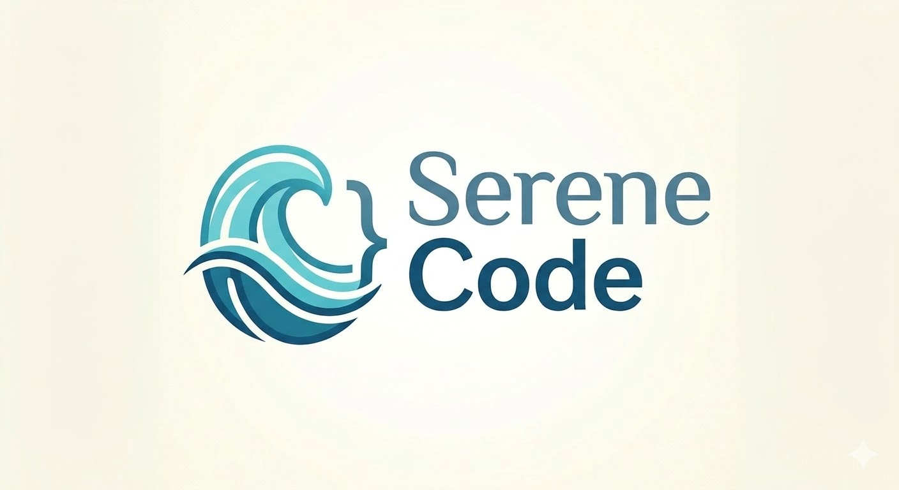

<p align="center">
  
</p>

<h3 align="center">A Framework for AI-Driven Development of Verifiable Systems</h3>

SereneCode turns the question from "did the model ship code?" to "does it match the spec, the types, and the contracts we agreed on?" It is a Python toolkit and workflow for teams using AI coding assistants: a structured spec (`REQ-xxx`, `INT-xxx`), a project-level `SERENECODE.md` that steers how code is written, and one verification pipeline you can drive **from the MCP server (recommended while editing)** or from the **CLI** (CI, scripts, and full-tree batch runs).

**Current verification evidence:** see the dated [verification record](docs/VERIFICATION_STATUS.md) for commands, results, counts, and scope. These docs describe the source checkout; they do not establish that unpublished fixes are available on PyPI.

## Recommended workflow

1. Install SereneCode in the environment containing your project's dependencies, then run `serenecode init`.
2. Write a structured `SPEC.md`, with requirements (`REQ-xxx`) and optional integration points (`INT-xxx`). Validate it with `serenecode spec SPEC.md`.
3. Implement and test the requirements, adding `Implements:` and `Verifies:` references. Use executable contracts to express input constraints and expected behavior.
4. During editing, use the MCP file/function tools for focused findings. Choose L1–L2 for static feedback; execution-based levels take longer.
5. Run the full CLI pipeline before merging and in CI. Review failures, incomplete checks, exemptions, and advisories.

Function-scoped MCP checks currently run the **file pipeline**, then select findings for the requested symbol while retaining relevant blockers. L3 can run the **whole project's test suite**, and its coverage cache lasts only for that request. Function scope does not guarantee a quick run or execution of only that function.

## What the checks establish

| Level | Checks | Backend |
|---|---|---|
| **L1** | Structural conventions, spec references, test-file presence, code-quality patterns, module health, likely dead code | AST analysis and vulture |
| **L2** | Static type checking | mypy with `--strict` |
| **L3** | Test outcome and per-function line/branch coverage | pytest, pytest-cov, coverage.py |
| **L4** | Contracts against generated inputs | Hypothesis |
| **L5** | Contract counterexamples within configured analysis budgets | CrossHair / Z3 |
| **L6** | Architectural and interface structure across modules | AST compositional analysis |

Normal runs start at L1. `--structural` requests L1 only; `--verify` starts at L3 and omits L1–L2. The Python pipeline can also start at a later stage. A later successful stage cannot erase an earlier incomplete stage in the requested run. For nonempty source scopes, L3–L5 each need at least one passing record, with no failed or skipped records; empty or exclusively exempt stage results do not demonstrate execution.

L3 fails when pytest fails, even if coverage is 100%. Both line and branch coverage must meet the per-function threshold (80% by default). Reports include uncovered paths and suggested tests; mock recommendations are heuristics to review, not requirements that all I/O must be mocked.

L4 uses a default budget of up to 100 generated examples per function. Its built-in strategies cover restricted domains, not every value accepted by a Python type. L5 has default budgets of 30 seconds per condition, 10 seconds per path, and 300 seconds per module. Neither a property-test pass nor “no counterexample found within analysis bounds” is proof of correctness. See [verification semantics](docs/VERIFICATION_LEVELS.md) for strategy domains and target eligibility.

L6 checks dependency direction, cycles, explicit Protocol inheritance and signature compatibility, contract presence, and declared integration structure. It does **not** prove that one function's postcondition logically satisfies another's precondition. `REQ`/`INT` tags establish references; a matching `Verifies:` tag does not establish that a test adequately checks the requirement's meaning.

### Conventions and code quality

The Default and Strict presets enable checks for stub bodies, mutable defaults, bare `assert` outside tests, `print()` in core, recognized dangerous calls, unfinished-work markers, tests without recognized assertions, silent exception handling, and simple tautological postconditions. These are syntax-based checks with documented suppression comments and exemptions; they do not detect every equivalent pattern or constitute a security audit. Minimal disables these additional code-quality rules by default.

Module health checks run in L1, including normal higher-level runs. Their thresholds are documented in each generated `SERENECODE.md`: exceeding a warning threshold produces an advisory; exceeding an error threshold fails the check. Test files are excluded from module health checks. Use `--skip-module-health` to disable them.

Test files receive applicable test-quality checks without production contract, annotation, or docstring requirements, or requests for `test_test_*.py`. Default/minimal path exemptions and backend eligibility rules still limit the scope of other checks.

### Choosing a preset

`serenecode init` generates conventions for one of three presets. The preset controls writing rules and the default verification depth; `--level` overrides depth without changing the preset's rules.

| | Minimal | Default | Strict |
|---|---|---|---|
| Default depth | L2 | L4 | L6 |
| Function contracts | Public functions | Public functions, with descriptions | Public and private functions, with descriptions |
| Architecture rules | Relaxed | Core/ports/adapters separation | Same separation, plus domain exceptions and loop/recursion comments |
| Path exemptions | Configured exemptions | Configured exemptions | None by default |
| Module health | Relaxed thresholds | Standard thresholds | Tighter thresholds |

Strict removes preset path exemptions; it does not make every function eligible for Hypothesis or CrossHair. Test-specific rules, stateless/Protocol exceptions, and explicit suppressions still apply. Invariant comments are checked for presence, not proved by a loop verifier. Choose a preset based on the checks you need and can maintain; it is not a certification or an assurance rating for a regulated system.

Configuration is read from supported patterns in `SERENECODE.md`, using preset defaults. Editing arbitrary prose or numbers does not necessarily change the configuration: for example, module-health threshold tables are documentation, and their numbers are not parsed as overrides. The Python `SerenecodeConfig` API supports explicit configuration. There is currently no `[tool.serenecode]` TOML policy loader.

## Example: hypothetical dosage calculator

The two examples illustrate contracts and verification on the same small problem. **They are demonstrations, not clinical software.** Their numeric limits and adjustment factors are invented example inputs, not medical guidance. They have no clinical validation or regulatory approval.

Both versions implement dose calculation, renal adjustment, a daily-total comparison, and one-directional contraindication lookup. Their tests passed in the [dated verification record](docs/VERIFICATION_STATUS.md). This side-by-side example does not measure a general improvement in AI-generated code quality.

| Property | Plain example | SereneCode example |
|---|---|---|
| Dose maximum | Unit-test expectations | Postcondition, unit tests, and property tests; `calculate_dose` is exempt from L5 |
| Renal adjustment | Unit tests | Runtime bounds and normal-tier postconditions; L5 found no counterexample to the written contracts within its bounds |
| Tier boundaries, such as CrCl 30 | Explicit unit tests | Explicit unit tests; the contracts do not specify every tier multiplier |
| Daily-result consistency | No consistency contract | `check_daily_safety` postconditions check consistency while contracts are enabled; direct `SafetyResult` construction does not enforce the full relationship |
| Immutability | Frozen dataclass fields with mutable containers | Also shallowly frozen: field assignment is blocked, but contained lists and sets remain mutable; invariants do not prevent in-place mutation |
| Executable specification | No icontract decorators | 42 decorators: 10 preconditions, 13 postconditions, 19 class invariants |

Only `adjust_for_renal_function` was exercised at L5 in the example's full run. The other three functions were exempt because of their signatures. A complete L6 verdict can include these exemptions. Arithmetic uses Python floats and retains their rounding and range limitations; it does not supply exact decimal dosing arithmetic.

Read [the plain version](examples/dosage-regular/) and [the SereneCode version](examples/dosage-serenecode/) side by side.

## Quick start

From this source checkout:

```bash
python -m pip install -e '.[mcp]'
# Alternatively: uv sync --extra mcp

serenecode doctor
serenecode init
```

The checkout's base dependencies include pytest and pytest-cov. Install it alongside the target project's dependencies. `doctor` reports the interpreter, package availability, spec discovery, and MCP registration hints; package discovery does not establish that every backend can successfully execute.

`init` creates `SERENECODE.md` and a SereneCode section in `CLAUDE.md`, plus `SPEC.md` and `SPEC.source.md` placeholders when absent. Replace placeholder requirements before implementation. The generated files instruct the coding assistant; the command itself does not write the implementation or validate a narrative spec's meaning. Conventions can be revised deliberately and checks rerun; there is no lock after implementation starts.

Register the stdio MCP server in your client. For Claude Code:

```bash
claude mcp add serenecode -- uv run serenecode mcp
# To enable L3–L6, register with --allow-code-execution:
claude mcp add serenecode -- uv run serenecode mcp --allow-code-execution
```

Use one registration appropriate to your trust settings. Other MCP clients can launch the same stdio command. Client setup and UI behavior depend on the client.

```bash
serenecode spec SPEC.md
serenecode check src/ --structural
serenecode check src/ --level 4 --allow-code-execution
serenecode check src/ --level 6 --allow-code-execution --format json
```

A project-root `SPEC.md` is discovered automatically. `--spec PATH` explicitly selects a structured spec elsewhere; a narrative file must first be converted to REQ/INT format. Scoped source checks preserve project import context and discover sibling implementation files for traceability.

## MCP tools and resources

| Tool | Purpose |
|---|---|
| `serenecode_check` | Run the pipeline on a project |
| `serenecode_check_file` | Check a source file with project context |
| `serenecode_check_function` | Resolve a symbol, check its file, return scoped findings and blockers |
| `serenecode_verify_fixed` | Confirm that a message substring is absent **and** the scoped check passes |
| `serenecode_suggest_contracts` | Suggest signature-derived contract scaffolding for review |
| `serenecode_uncovered` | Report L3 uncovered paths and mock suggestions for a function |
| `serenecode_suggest_test` | Suggest a test scaffold for a function |
| `serenecode_validate_spec` | Validate a structured spec's format |
| `serenecode_list_reqs` | List requirement IDs |
| `serenecode_list_integrations` | List integration IDs |
| `serenecode_req_status` | Report one requirement's implementation/test references |
| `serenecode_integration_status` | Report one integration's references |
| `serenecode_orphans` | List requirements missing implementation or test references |
| `serenecode_dead_code` | Report likely dead code for review |
| `serenecode_module_health` | Return AST metrics and split suggestions for a file |

Function checks accept qualified names such as `Calculator.total`. Missing or ambiguous symbols return an error. A file-level failure can block a symbol check, and a target with no applicable execution evidence cannot borrow another function's passing result. `verify_fixed` still matches message substrings, not stable finding IDs.

The server exposes `serenecode://config`, `serenecode://findings/last-run`, `serenecode://exempt-modules`, `serenecode://reqs`, and `serenecode://integrations`. These resources provide session/configuration context; they are not a persistent cache of verified source revisions.

## Python API and results

```python
import serenecode

result = serenecode.check(path="src/", level=5, allow_code_execution=True)
for failure in result.failures:
    print(f"{failure.function} @ {failure.file}:{failure.line}")
    for detail in failure.details:
        if detail.counterexample is not None:
            print(detail.counterexample)
        if detail.suggestion is not None:
            print(detail.suggestion)
```

The CLI, library API, and MCP tools use the same pipeline. JSON output includes `passed`, `level_requested`, `level_achieved`, `timestamp`, `summary`, and `results`; MCP projects that into its wire schema with `findings`. MCP findings omit passing records and ordinary exemptions; use CLI JSON results to inspect those records and their reasons. The verdict is `complete`, `failed`, or `incomplete`.

**Counts are result records, not unique functions.** `summary.total_functions` is a legacy field name: the same symbol can have records at multiple levels, and module/spec records also count. `advisory_count` is a subset of `exempt`, not an additional status to add to the total. A passing record describes its own stage, not assurance that the symbol passed every level. Review the requested scope, exemptions, skips, and bounds alongside the verdict. Empty source scopes can pass vacuously and should not be treated as evidence of execution.

## CLI Reference

```bash
serenecode init [<path>]                                                # interactive setup
serenecode doctor                                                       # backend availability, MCP setup, spec discovery
serenecode spec <SPEC.md>                                               # validate spec readiness
                [--format human|json]
serenecode check [<path>] [--level 1-6] [--allow-code-execution]        # run verification
                          [--spec SPEC.md]                              #   spec traceability
                          [--project-root DIR]                          #   root for imports, config + traceability
                          [--format human|json]                         #   output format
                          [--structural] [--verify]                     #   L1 only / L3-6 only
                          [--skip-module-health]                        #   skip file/function/param/class size checks
                          [--fail-on-advisory]                         #   exit 11 if advisories remain
                          [--per-condition-timeout N]                   #   L5 CrossHair budgets
                          [--per-path-timeout N] [--module-timeout N]   #   (defaults: 30/10/300s)
                          [--coverage-timeout N]                        #   L3 pytest/coverage subprocess (default 600s)
                          [--workers N]                                 #   L5 parallel workers (cap 32)
serenecode status [<path>] [--format human|json]                        # fresh L1 status check
serenecode report [<path>] [--format human|json|html]                   # generate reports
                           [--output FILE] [--allow-code-execution]     #   write to file
serenecode mcp [--allow-code-execution]                                 # boot the MCP server
               [--project-root DIR]                                     #   default root; stdio transport
```

**Environment (optional):** `SERENECODE_MAX_WORKERS` overrides `--workers`; `SERENECODE_COVERAGE_TIMEOUT` overrides `--coverage-timeout`. **`SERENECODE_DEBUG=1`** logs subprocess environment **key names** (not values) when tools spawn mypy, pytest, CrossHair, etc. Details: [docs/SECURITY.md](docs/SECURITY.md).

**Exit codes:** 0 = passed (and no `--fail-on-advisory` violation), 1–6 = first failing verification level (structural … compositional), 10 = incomplete verification, internal error, or deep verification refused without `--allow-code-execution`, **11 = advisories remain with `--fail-on-advisory`** (dead code, module health warnings; checks otherwise passed).


## Security and limitations

Levels 3–6 require explicit `--allow-code-execution` because they run project code. The tool does not sandbox filesystem or network access. Hypothesis may execute in the server process; subprocess backends receive a filtered environment but retain your user privileges. L1–L2 omit the execution-based stages, but configured mypy plugins can also execute Python. See the [trust model](docs/SECURITY.md).

Runtime icontract checks are enabled by default under normal Python execution. They can be disabled with a decorator's `enabled` argument or, for decorators using the default, `python -O` / `PYTHONOPTIMIZE`. They check only the conditions written, at the points wrapped by icontract. Frozen dataclasses and invariants do not imply deep immutability or continuous monitoring of mutable fields.

A clean check does not establish that a spec is complete, that contracts capture intent, or that every input and dependency was checked. L4 strategies are restricted; L5 is bounded; L6 is structural. Suppressions and exemptions require review. Hypothesis runs with `deadline=None`; there is no general per-request timeout for a hanging property target. Wider benchmarks, persistent incremental verification, baseline/diff gating, and strategy registration remain opportunities documented in the [project review](docs/PROJECT_REVIEW.md).

## Self-verification and architecture

The repository tests its own pipeline through unit, integration, and end-to-end tests. CI is configured for Python 3.10 and 3.13, strict mypy, a clean-wheel L3 smoke check, L2 self-checks, and a separate Python 3.13 full L6 job. This describes the workflow configuration, not an assertion that a remote CI run has passed.

The strict self-check integration test starts at **L4**. It exercises L4–L6 with `strict_config()` and does not establish compliance with strict L1 rules. The separate full CLI self-check uses the repository's **default** configuration and starts at L1. Recorded local evidence is in [VERIFICATION_STATUS.md](docs/VERIFICATION_STATUS.md).

The CLI, library API, and MCP server compose a pipeline of checkers. Filesystem access and external tools sit behind ports/adapters; result models provide a shared representation for reporters. L6 checks supported architectural rules in this arrangement.

## Relationship to other spec-driven tools

Kiro documents requirements, design, and task workflows across its IDE, CLI, and web surfaces, and property-based correctness testing in its IDE. It is broader than a Python verification library. [Kiro specs documentation](https://kiro.dev/docs/specs/).

GitHub's Spec Kit provides a specification-driven workflow using a constitution, specification, plan, tasks, implementation, and convergence commands. [Spec Kit repository](https://github.com/github/spec-kit).

SereneCode supplies a Python CLI/MCP pipeline for executable contracts, static checks, tests, bounded symbolic search, and REQ/INT references. It can be used with an authoring workflow that produces suitable Python and a structured spec. The comparison above was checked on 7 September 2026; it is not an exclusive feature or effectiveness claim.

## Disclaimer

SereneCode is provided as-is, without warranty. It cannot guarantee the absence of bugs and does not substitute for independent review, domain validation, or required certification. Users remain responsible for their systems' correctness, safety, and regulatory compliance.

## License

MIT
